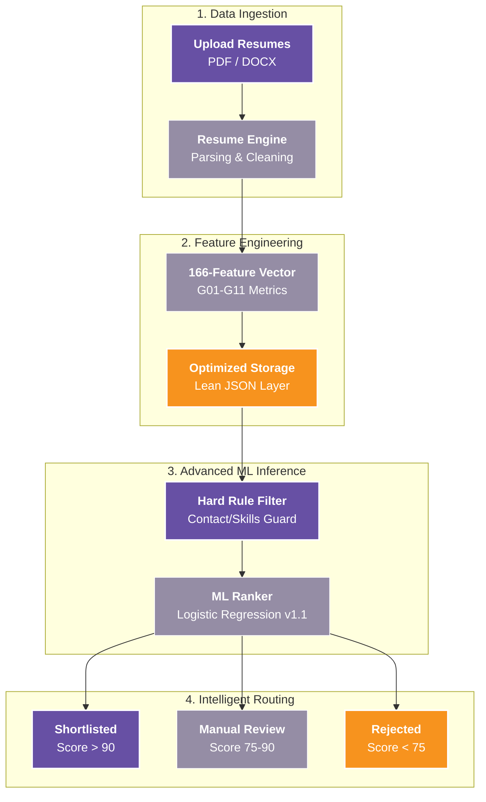

# 🌟 Resume Intelligence Platform

<p align="center">
  
  
  
  
  
</p>

An industry-grade **Resume Intelligence Platform** designed to solve the "Recruiter Fatigue" problem. This system automates the transformation of unstructured resumes into high-quality hiring decisions using a hardened **18-signal "Extreme Depth" feature vector** optimized for true applicant ranking.

It bridges the gap between raw document parsing (Layout-Aware) and intelligent candidate ranking, all while maintaining a 100% offline, privacy-first data lifecycle.

---

### 🏛️ System Architecture & Flow



---

### 🔥 Key Innovations

#### 🛠️ **"Extreme Depth" Architectural Hardening**
The platform is built on a modular, package-based architecture modeled after top-tier MLOps patterns. 
*   **Core**: Unified metadata and versioning (v1.1.0).
*   **Engine**: Plug-and-play model registry (LR/RF/XGB).
*   **Data**: JSON-First Lifecycle—eliminating legacy CSV dependency.
*   **Parser**: Layout-aware extraction using PyMuPDF (fitz) for complex multi-column resumes.

#### 🛡️ **Zero-Trust CI/CD & Type-Safety (v1.1.1)**
The platform now enforces a strict **Zero-Trust ML Pipeline** to ensure supply-chain security and runtime stability.
*   **100% Type-Safety**: Achieved a 0-error Pyright status across the entire ML engine, eliminating technical debt and runtime logic errors.
*   **Isolated CI Build**: GitHub Actions environment is configured with `permissions: contents: read` and restricted binary execution.
*   **Dependency Hardening**: All 3rd-party ML libraries (`sklearn`, `pandas`, `numpy`) are handled via defensive, lazy-loading imports with static type markers to prevent environment-specific failures.
*   **Safe-Trigger Logic**: CI/CD runs are skipped for non-runtime changes (e.g., `.md` docs) to optimize build cycles.

---

### 💻 Tech Stack & Tools

| Category | Tools & Libraries |
| :--- | :--- |
| **Language** |  |
| **Machine Learning** |   |
| **Data Processing** |   |
| **Parsing** |   |
| **Static Analysis** |  |
| **CI/CD** |  |

---

### 🚀 Getting Started

#### 📦 **Installation**
The platform features automated environment management. You just need to run the setup script for your OS.

**Linux/macOS (Inference & Training):**
```bash
cd ml-service/ml-engine/
./run_batch.sh       # Run Batch Inference
./train_pipeline.sh  # Run End-to-End Training
```

**Windows (Inference & Training):**
```cmd
cd ml-service\ml-engine\
run_batch.bat        # Run Batch Inference
train_pipeline.bat   # Run End-to-End Training
```

#### 📂 **Input/Output Workflow**
1.  Drop resumes into `/data/uploads/` (Project Root).
2.  Run the batch or training script above.
3.  Check `/data/processed/` for extraction JSONs and `/data/results/` for final decisions.

---

### 🤝 References & Credits
*   **Vectorization**: Based on the 165+ feature engineering ATS schema for resume processing.
*   **Architecture**: Specialized for Low-Resource Environments (i3-sim) to High-End RTX Workstations.
*   **Inspiration**: Built for the **Resume Intelligence Platform** suite.

---

<p align="center">
  
  
</p>
