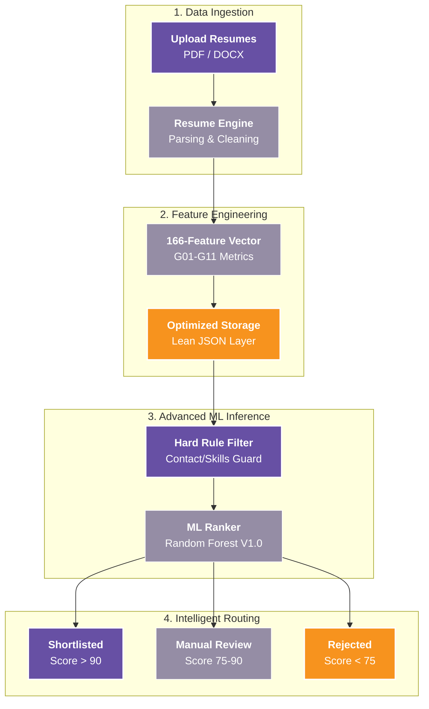

# 🌟 Resume Intelligence Platform

<p align="center">
  
  
  
  
  
</p>

### 🚀 Overview
An industry-grade **Resume Intelligence Platform** designed to solve the "Recruiter Fatigue" problem. This system automates the transformation of unstructured resumes into high-quality hiring decisions using a 166-feature vectorization pipeline.

It bridges the gap between raw document parsing and intelligent candidate ranking, all while maintaining a 100% offline, privacy-first data lifecycle.

---

### 🏛️ System Architecture & Flow



---

### 🔥 Key Innovations

#### 🛠️ **Industry-Grade Layout Refactoring**
The platform is built on a modular, package-based architecture modeled after top-tier MLOps patterns. 
*   **Core**: Unified metadata and versioning.
*   **Engine**: Plug-and-play model registry.
*   **Data**: Resource-optimized ingestion layers.

#### 🚦 **3-Tier Routing & Hard Rejection**
*   **Tier 1 (Shortlisted)**: Direct candidate ranking for high-potential applicants.
*   **Tier 2 (Manual Review)**: Intelligent queue management with capacity-limited pruning to prevent burnout.
*   **Tier 3 (Rejected)**: Immediate feedback with explainable rejection reasons.
*   **Guardrails**: Automated rejection for missing Name, Email, or Phone to ensure database integrity.

#### 🔐 **Resource Safety & Automated Shredding**
*   **Lean Persistence**: Intermediate data excludes heavy raw text to save 90% storage space.
*   **Auto-Cleanup**: Automated 24-hour file shredding for raw uploads, ensuring strict privacy compliance.

---

### 💻 Tech Stack & Tools

| Category | Tools & Libraries |
| :--- | :--- |
| **Language** |  |
| **Machine Learning** |   |
| **Data Processing** |   |
| **Parsing** |   |
| **Inference Framework** |  |

---

### 🚀 Getting Started

#### 📦 **Installation**
The platform features automated environment management. You just need to run the setup script for your OS.

**Linux/macOS:**
```bash
cd ml-service/ml-engine/
./run_batch.sh
```

**Windows:**
```cmd
cd ml-service\ml-engine\
run_batch.bat
```

#### 📂 **Input/Output Workflow**
1.  Drop resumes into `ml_engine/data/uploads/`.
2.  Run the batch script above.
3.  Check `ml_engine/data/results/` for final hiring decisions.

---

### 🤝 References & Credits
*   **Vectorization**: Based on the 165+ feature engineering ATS schema for resume processing.
*   **Architecture**: Specialized for Low-Resource Environments (i3-sim) to High-End RTX Workstations.
*   **Inspiration**: Built for the **Resume Intelligence Platform** suite.

---

<p align="center">
  
  
</p>
